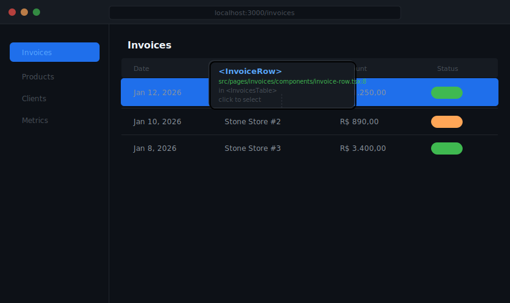
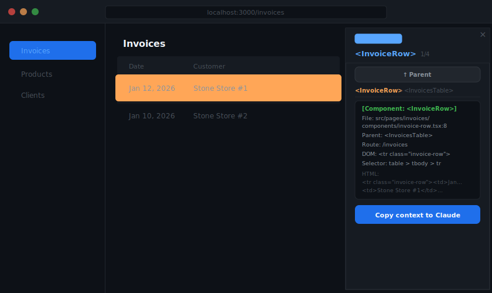

# Chrome Element Selector

A Chrome extension to inspect React components and DOM elements, generating context snippets ready to paste into Claude.

## Features

- **Hover** over any element to see its React component name and source file
- **Click** to lock the selection and open the context panel
- **↑ Parent** button to walk up the DOM tree
- Works with **React components** (shows name, file, parent) and **plain DOM elements** (shows tag, id, classes, CSS selector)
- **One-click copy** — generates a structured snippet to paste directly into Claude

## Installation

1. Clone this repository
   ```bash
   git clone git@github.com:matheusMFCosta/chrome-element-selectior.git
   ```
2. Open Chrome and navigate to `chrome://extensions`
3. Enable **Developer Mode** (toggle in the top-right corner)
4. Click **Load unpacked** and select the cloned folder
5. The extension icon will appear in your Chrome toolbar

## Usage

1. Navigate to any webpage (works on `localhost` and production sites)
2. Click the **Claude Element Selector** icon in your toolbar
3. Hover over elements — a tooltip shows the React component and source file
4. Click an element to lock the selection (selector deactivates, orange highlight appears)
5. Use **↑ Parent** to navigate to the parent HTML element
6. Click **Copy context to Claude** and paste the snippet into your conversation

## Screenshots

### Hovering — tooltip shows component name and file


### Selected — panel with full context ready to copy


## Snippet format

When you copy context, the snippet looks like this:

```
[Component: <InvoiceRow>]
File: src/pages/invoices/components/invoice-row.tsx:8
Parent: <InvoicesTable>
Route: /invoices
URL: http://localhost:3000/invoices
DOM: <tr class="invoice-row">
Selector: table > tbody > tr

HTML:
<tr class="invoice-row"><td>Jan 12, 2026</td>…
```

## How it works

The extension injects a content script that reads React's internal fiber tree (`__reactFiber$`) directly from DOM nodes to resolve component names and source locations — no build plugin or source map configuration required.

## License

MIT
